# 
Projet OkBoomer

## Sommaire
1. [Presentation](#presentation)
2. [Le site](#LeSite)
3. [Inscritpion](#LaPageInscrption)
4. [Connexion](#Connexion)
5. [Créer Base de données](#LaBaseDeDonnées)
5. [Ajouter des amis](#AjoutAmi)

# Presentation

Le but de ce projet est de créer un réseau social pour les seniors en php. Les seniors choisissent les activités qu'ils souhaitent effectuer, un lieu proche de chez eux leur est proposée et avant d'effectuer l'activité , ils peuvent apprendre à se connaitre dans un salon de tchat.

# LeSite 
* ##  *Diagramme de classe*  
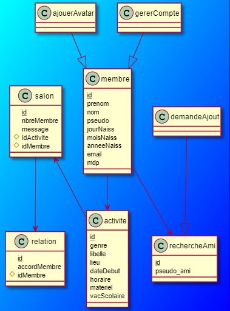 

* ##  *Diagramme de cas d'utilisation*  
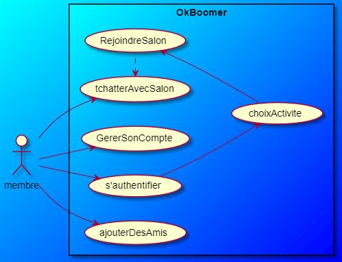 

* ##  *Les Activités*  
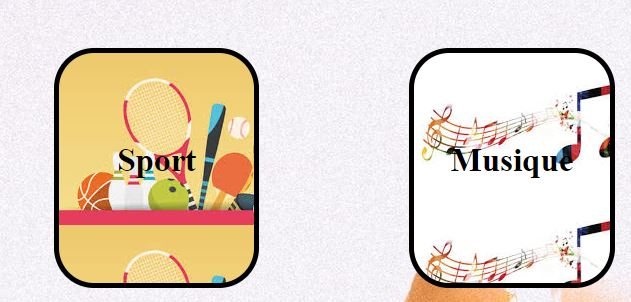 

# LaPageInscrption
* ##  *Formulaire d'inscription*  
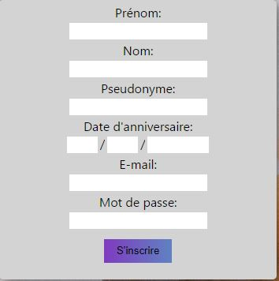 

* ##  *Code inscription*  
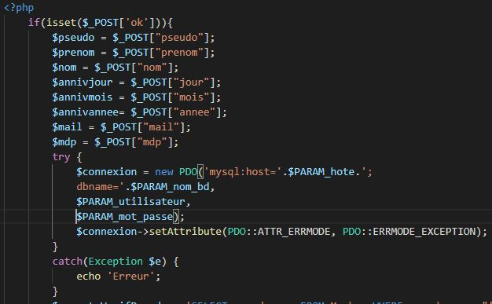 

* ##  *Condition pour l'inscription*  
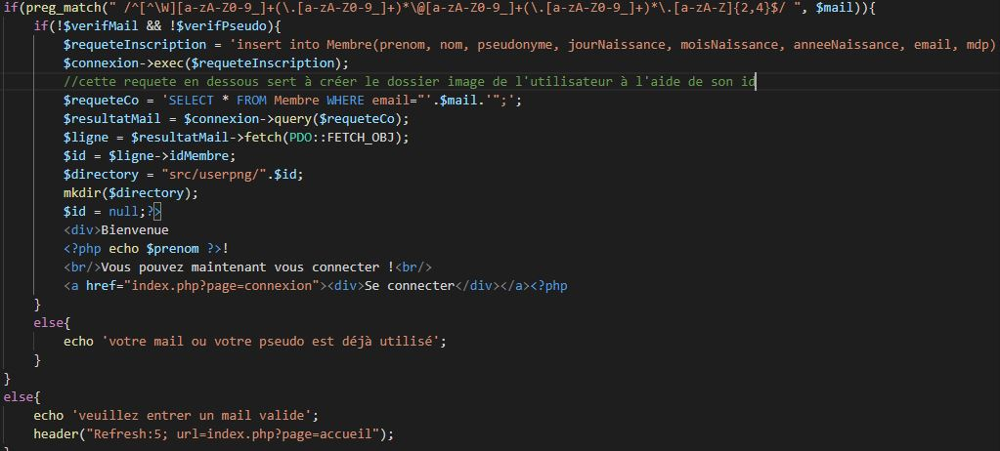 

# Connexion
* ##  *Formulaire de connexion*  
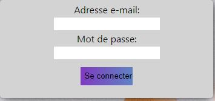 

* ##  *Code  de connexion (PHP)*  
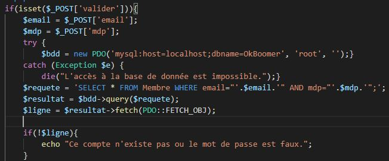 

* ##  *Le form (HTML)*  
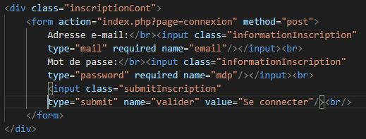 

# LaBaseDeDonnées
* ##  *Membre*  
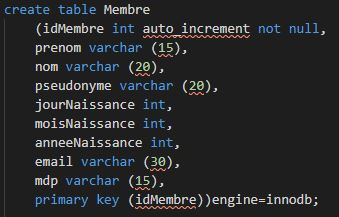 

* ##  *Activité*  
 

* ##  *Ajouter des amis*  
 

# AjoutAmi

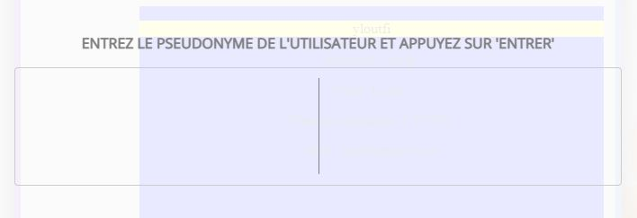 

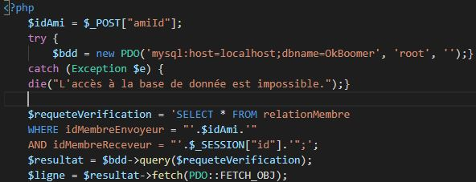 

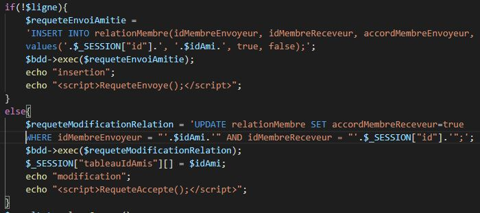 

